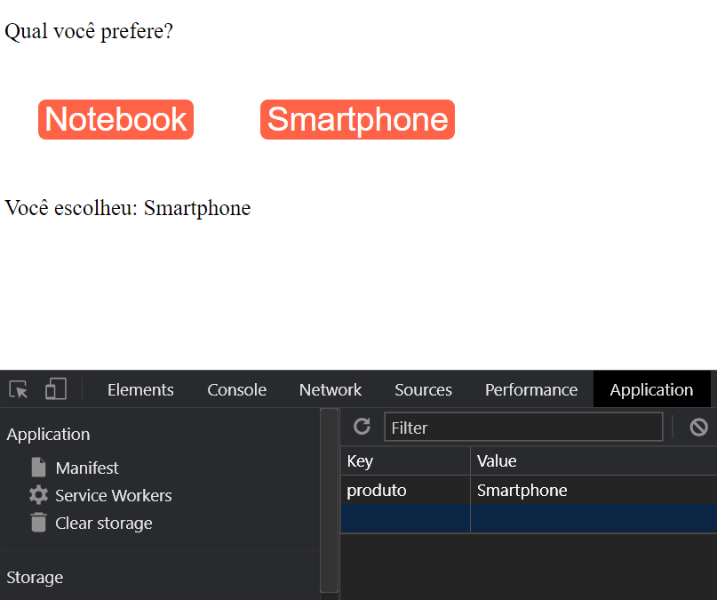

# React Completo Origamid - Módulo React Hooks - <i>custom hooks 1 - Local Storage</i>
## Descrição:

Podemos criar nossos próprios hooks, assim evitamos a repetição de código. Todo custom hook deve começar com a palavra use. Exemplo: useNomeDoHook. Podemos retornar o que quisermos do hook, seja um valor único, uma array ou um objeto.

A aplicação mostra dois botões onde podemos escolher qual é o nosso produto favorito, ao clicar em um deles, o favorito é guardado no local storage e renderizado na tela, quando atualizamos a página continua aparecendo o produto favorito no local storage e na tela

## Ferramentas e Aprendizados:
<li>React.JS </li>
<li>Custom hooks - useLocalStorage </li>

## Imagem do app:

