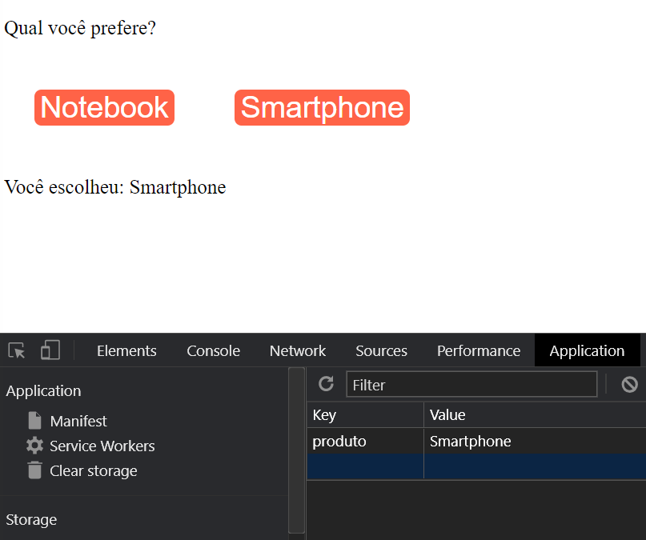

# React Completo Origamid - Módulo React Hooks - <i>custom hooks 2 - useFetch</i>
## Descrição:

o useFetch é usado mais ou menos da mesma forma sempre. Ele será composto por um estado para todas as informações (ex. data), um estado para os erros (ex. error), um estado para o que for carregar (ex.: loading) e uma função para pode fazer o request 

## Ferramentas e Aprendizados:
<li>React.JS </li>
<li>Custom hooks - useFetch </li>

## Imagem do app:

