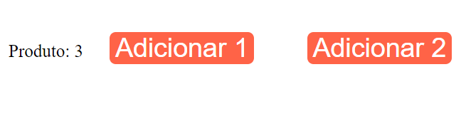

# React Completo Origamid - Módulo React Hooks - <i>useContext 1</i>
## Descrição:

A aplicação dá dois exemplos de como usar o useContext, um deles é colocando o estado global e utilizando esse estado no componente Produto e outro é colocando uma função com acesso global e passando para o componente produto, que vai utilizar através do global.

## Ferramentas e Aprendizados:
<li>React.JS </li>
<li>useContext</li>

## Imagem do app:

