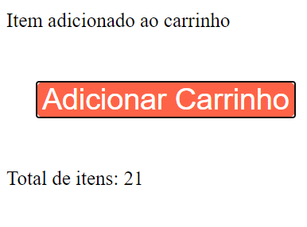

# React Completo Origamid - Módulo React Hooks - <i>useRef 2</i>
## Descrição:

 Segundo exemplo de como usar useRef: 
Podemos utilizar também para guardarmos a referência de qualquer valor, como de um setTimeout por exemplo.

 Carrinho de um e-commerce que toda vez que adiciona um item no carrinho é dada uma notificação dizendo que o item foi adicionado ao carrinho

Matéria bem difícil de entender!!

## Ferramentas e Aprendizados:
<li>React.JS </li>
<li>useRef</li>

## Imagem do app:

