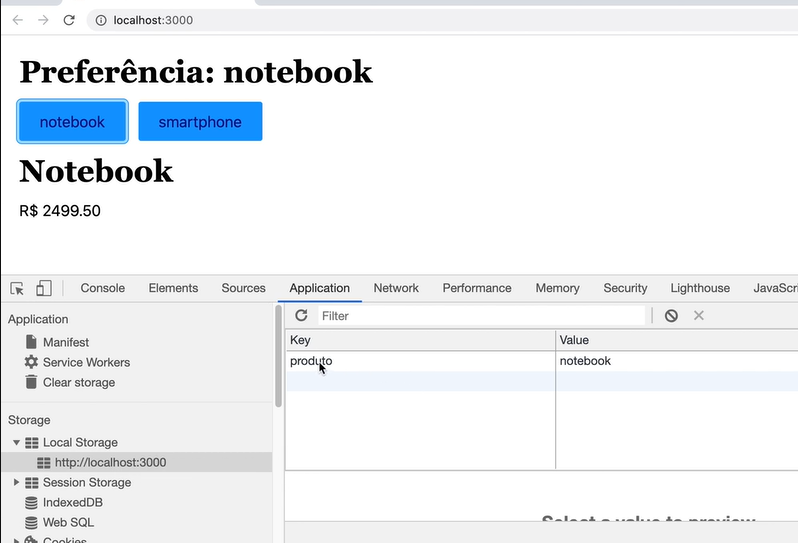

# React Completo Origamid - Módulo React Hooks - <i>useEffect 2</i>
## Enunciado: 
 
Quando o usuário clicar em um dos botões, faça um fetch do produto clicado utilizando a api abaixo
 https://ranekapi.origamid.dev/json/api/produto/notebook
 https://ranekapi.origamid.dev/json/api/produto/smartphone
 Mostre o nome e preço na tela (separe essa informação em um componente Produto.js)
 Defina o produto clicado como uma preferência do usuário no localStorage
 Quando o usuário entrar no site, se existe um produto no localStorage, faça o fetch do mesmo

## Ferramentas e Aprendizados:
<li>React.JS </li>
<li>useEffect</li>
<li>Local Storage</li>
<li></li>

## Explicações importantes:

## Imagem do app:

